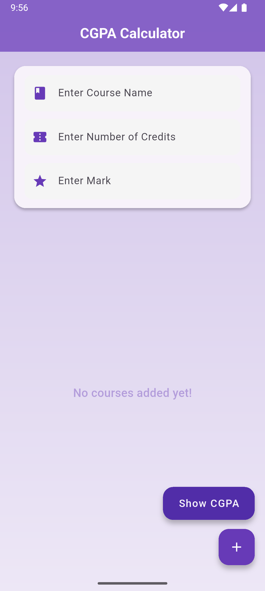
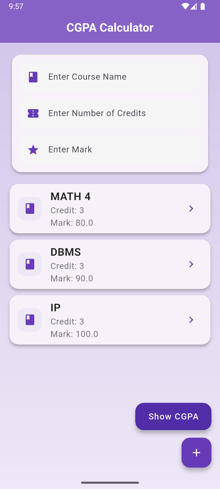
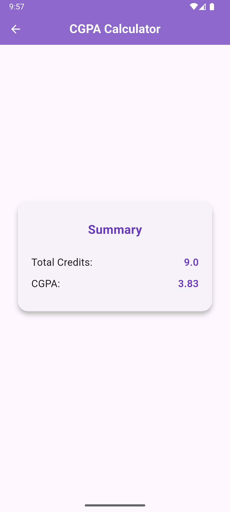

# CGPA Calculator

A simple and intuitive CGPA (Cumulative Grade Point Average) calculator built with Flutter. Easily add your courses, credits, and marks to calculate your CGPA instantly.

## Features

* **Easy Course Entry:** Quickly input course names, credit hours, and marks.
* **Dynamic Course List:** See all your added courses in a clear list.
* **Instant CGPA Calculation:** Get your CGPA summarized at the touch of a button.
* **Clean UI:** A user-friendly interface designed for a smooth experience.

## Screenshots

| Empty State                                                                                                | Courses Added                                                                                                  | CGPA Summary                                                                                                 |
| :--------------------------------------------------------------------------------------------------------- | :----------------------------------------------------------------------------------------------------------- | :----------------------------------------------------------------------------------------------------------- |
|  |  |  |

## How to Use

1.  **Enter Course Details:** Use the input fields at the top to enter the "Course Name," "Number of Credits," and "Mark" for each course.
2.  **Add Course:** Tap the `+` button in the bottom right corner to add the course to your list.
3.  **View Courses:** The added courses will appear in a list below the input fields.
4.  **Calculate CGPA:** Once you've added all your courses, tap the "Show CGPA" button to see your calculated CGPA and total credits.

## Getting Started with Development

To get a local copy up and running, follow these simple steps.

### Prerequisites

This project requires Flutter to be installed on your machine.

* Flutter SDK: [https://flutter.dev/docs/get-started/install](https://flutter.dev/docs/get-started/install)

### Installation

1.  Clone the repo:

    ```bash
    git clone [https://github.com/OnoPUNPUN/cgpa_calculator.git](https://github.com/OnoPUNPUN/cgpa_calculator.git)
    ```

    (Replace `your_username` with your actual GitHub username and `cgpa_calculator` with your repository name)
2.  Navigate to the project directory:

    ```bash
    cd cgpa_calculator
    ```
3.  Get Flutter packages:

    ```bash
    flutter pub get
    ```
4.  Run the app:

    ```bash
    flutter run
    ```

## Contributing

Contributions are what make the open source community such an amazing place to learn, inspire, and create. Any contributions you make are **greatly appreciated**.

If you have a suggestion that would make this better, please fork the repo and create a pull request. You can also simply open an issue with the tag "enhancement".
Don't forget to give the project a star! Thanks again!

1.  Fork the Project
2.  Create your Feature Branch (`git checkout -b feature/AmazingFeature`)
3.  Commit your Changes (`git commit -m 'Add some AmazingFeature'`)
4.  Push to the Branch (`git push origin feature/AmazingFeature`)
5.  Open a Pull Request

## Contact

punpunonodera754@gmail.com

Project Link: [https://github.com/OnoPUNPUN/cgpa_calculator.git](https://github.com/OnoPUNPUN/cgpa_calculator.git)